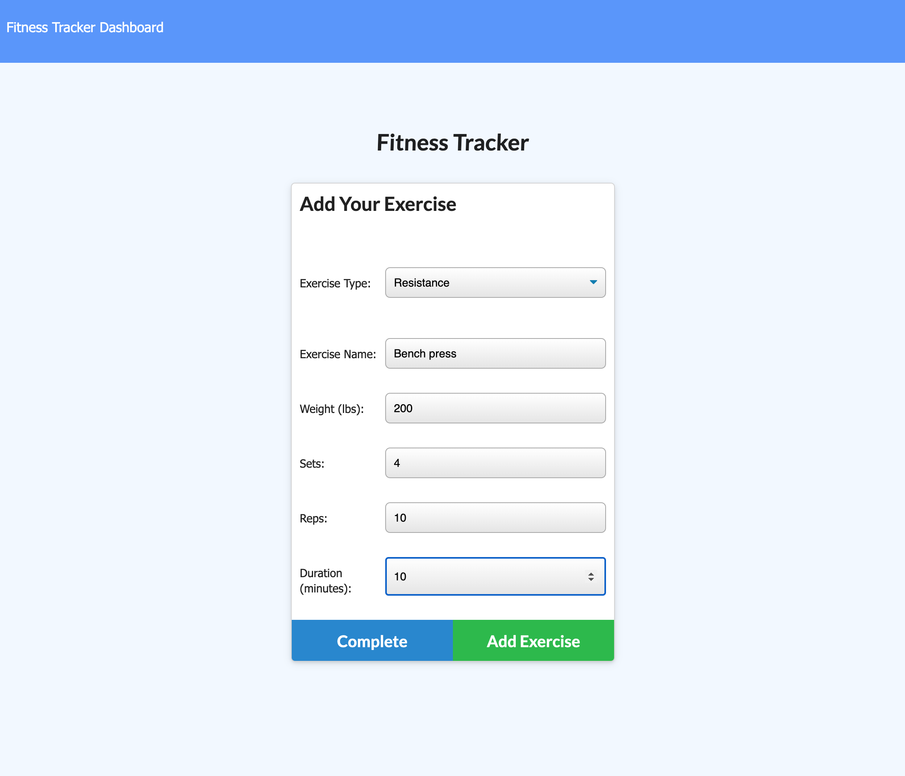

# Fitness Tracker

The Fitness Tracker is a Full Stack Web Application which allow the user to register workouts and the related exercises. While keeping relevant information like duration, weight, duration, repetitions and distance, the app displays a useful dashboard to display the user's workouts progress.

## Badges

Code quality and validation

Repository Status

License

## Table of contents

- [Fitness Tracker](#fitness-tracker)
  - [Badges](#badges)
  - [Table of contents](#table-of-contents)
  - [The challenge](#the-challenge)
  - [The development process](#the-development-process)
  - [The Output](#the-output)
  - [Installation and Usage](#installation-and-usage)
  - [Credits, tools and other references](#credits-tools-and-other-references)
  - [Contributing](#contributing)
  - [Questions](#questions)

## The challenge

From a provided front end code, the challenge is to create Mongo database with a Mongoose schema and handle routes with Express.

Main elements:

- [x] MVC model application
- [x] HTML, CSS, JS front end
- [x] Chart.js Dashboard
- [x] Mongo Database
- [x] Mongoose Schema
- [x] Express routing and server

## The development process

In order to accomplish the challenge, the following steps were done:

1. Review the provided front end, its functionality and API requests.
2. Research the Chart.js API
3. Define the Mongoose models and schema.
4. Build the server.
5. Define the HTML and API routes.
6. Final review and proper documentation.

## The Output

With the described process we were able to create a useful, efficient, responsive, and engaging application.

**User stories**

As a user, I want to be able to view create and track daily workouts. I want to be able to log multiple exercises in a workout on a given day. I should also be able to track the name, type, weight, sets, reps, and duration of exercise. If the exercise is a cardio exercise, I should be able to track my distance traveled.

**The application**

## Installation and Usage

The project was uploaded to [GitHub](https://github.com/) at the following repository:
[https://github.com/jorguzman100/17_Workout_Tracker](https://github.com/jorguzman100/17_Workout_Tracker)

You can access the deployed application with the Heroku link:
[https://ancient-chamber-62452.herokuapp.com/](https://ancient-chamber-62452.herokuapp.com/)

To install the project follow these steps:

1. Clone the application from GitHub with:
   - git clone [clone link from GitHub]
2. From the root folder, install the dependencies with:
   - npm install
3. Run the app with:
   - node server.js

## Credits, tools and other references

**Third Party Assets**

[Chart.js](https://www.chartjs.org/)

[CSS Materialize](https://materializecss.com/)

[Bootstrap](https://getbootstrap.com/)

[Shields.io](https://shields.io/)

[LGTM](https://lgtm.com/)

[Markup Validation Service](https://validator.w3.org/)

## Contributing

- Pull requests are welcome.
- For major changes, please open an issue first to discuss what you would like to change.
- Please make sure to update tests as appropriate.

## Questions

If you have questions or you want to share comments, we will be glad to hear from you. Please contact us at jorguzman100@gmail.com.
